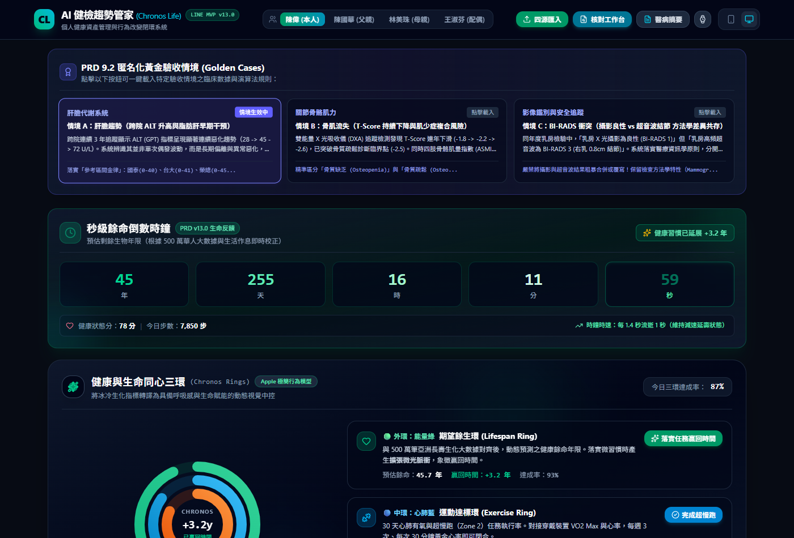
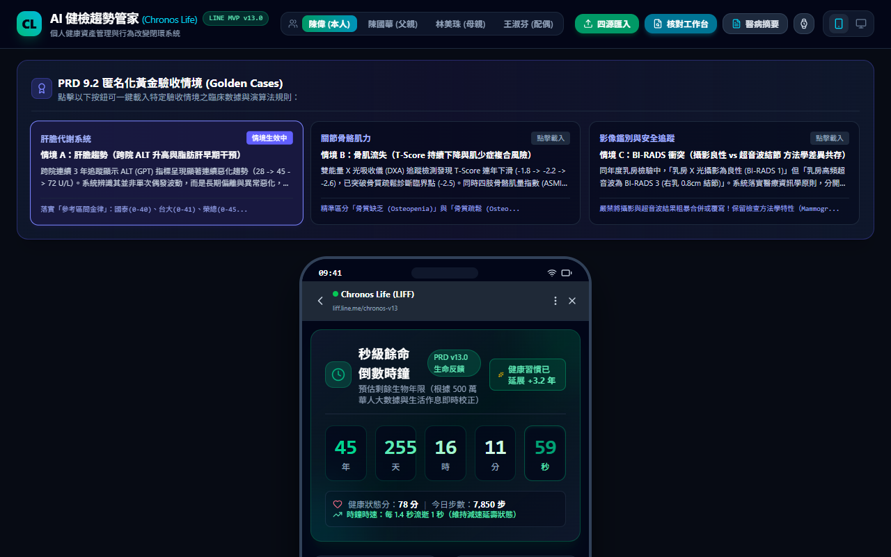
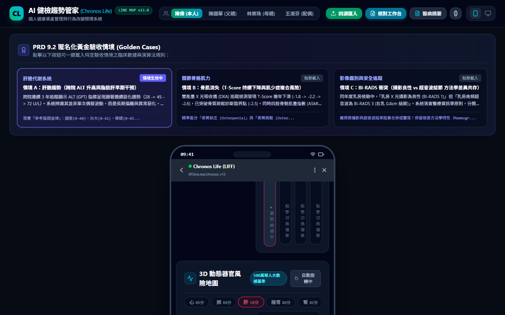
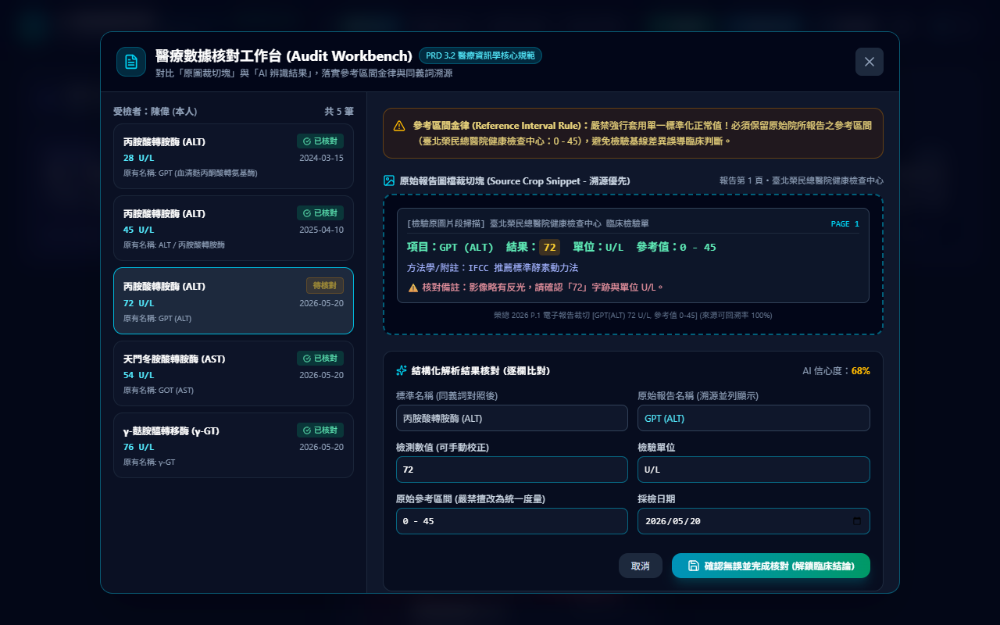
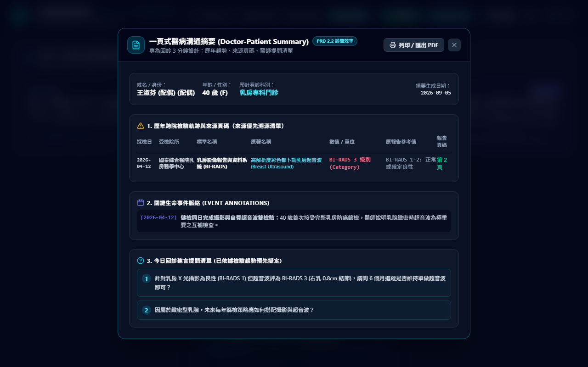
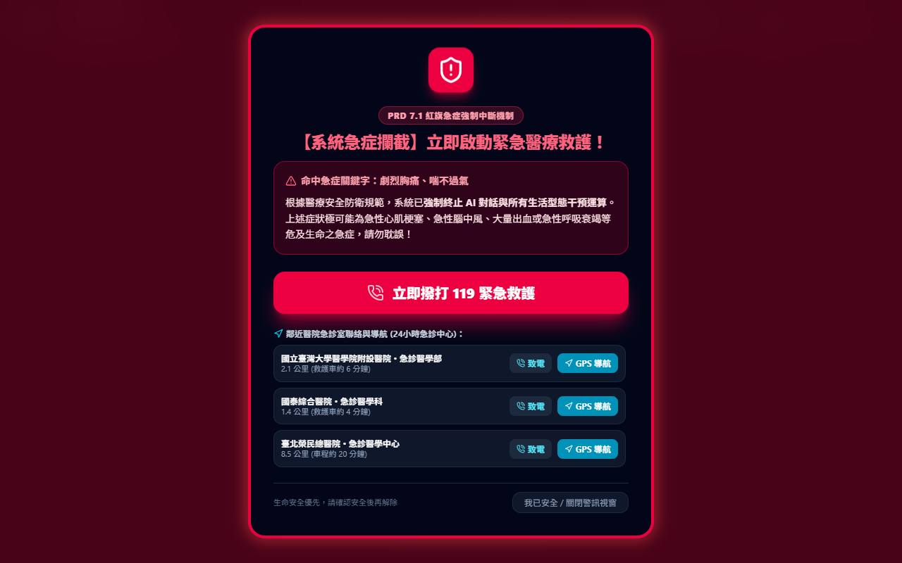

# AI 健檢趨勢管家 (Chronos Life) LINE MVP v15.0

> **將碎片化的「數據孤島」重塑為具備增值潛力的「個人健康資產 (Health Assets)」**  
> 基於超高齡社會預防醫學架構，結合 LINE 平台即時性、LLM + RAG 醫學轉譯、3D 人體器官透視、Apple 極簡同心三環、多模態 Vision-LLM 飲食熱量解析、穿戴裝置即時遙測同步、全維度長期數據監控、SQLite 原生輕量資料庫與嚴格醫療資訊學規則之完整行為改變閉環系統。

[](LICENSE)
[](https://react.dev/)
[](https://www.typescriptlang.org/)
[](https://capacitorjs.com/)
[](https://nodejs.org/)
[](https://github.com/feynmanwen/Chronos-Life-LINE-MVP/releases/tag/v15.0-android)

---

## 📲 Android 專屬安裝包 (APK) 直接下載

- 🚀 **[點此直接下載 Chronos Life v15.0 APK (7.7 MB)](https://github.com/feynmanwen/Chronos-Life-LINE-MVP/releases/download/v15.0-android/app-debug.apk)**
- 📦 **[GitHub Releases 官方發布頁面 (v15.0)](https://github.com/feynmanwen/Chronos-Life-LINE-MVP/releases/tag/v15.0-android)**
- 📱 支援 Android 手機（直式沉浸式介面）與 Android 平板（橫向雙欄工作台）。
- 🎨 完整內嵌官方專屬圖示 `CH.jpg`（生命樹健康檢查徽章）。

---

## 🌟 核心產品特色與視覺展示

### 1. 🟢 健康與生命同心三環 (Chronos Rings)
借鑑 Apple Watch 經典的圓環行為改變模型，將臨床生化指標（如 eGFR、ALT、LDL-C）轉譯為直觀、具備「呼吸感」與「生命賦能」的動態視覺中控：
- 🟢 **外環：能量綠 ——「期望餘生環（Lifespan Ring）」**：對齊 500 萬筆亞洲長壽生化大數據，動態預測健康餘命年限。落實微習慣時產生**擴張微光脈衝**，象徵「贏回時間」。
- 🔵 **中環：心肺藍 ——「運動達標環（Exercise Ring）」**：30 天心肺有氧與超慢跑（Zone 2）任務執行率，實時對接穿戴裝置 VO2 Max 與靜止心率。
- 🟠 **內環：飲食橘 ——「膳食控制環（Diet Ring）」**：多模態 AI 飲食拍照辨識後的熱量與營養合規率，避開高鹽高嘌呤，保護 ALT 與 eGFR 腎過濾負擔。



---

### 2. ⏱️ 秒級餘命倒數時鐘 (Life Expectancy Gauge) 與動態生命樹
- **秒級餘命倒數時鐘**：首頁醒目展示剩餘生物年限（年/天/時/分/秒）。當維持優良生活習慣時，時鐘倒數時速自動減慢（每 1.4 秒流逝 1 秒），提供具震撼力之生命反饋。
- **動態生命樹**：HTML5 Canvas 向量生成樹木分形動畫，睡眠充足或打卡任務孕育翠綠新芽；長期紅字未改善或中斷時葉片發黃枯萎。



---

### 3. 🫀 3D 動態器官風險地圖 (OrganMap 3D)
- 使用 **Three.js (WebGL)** 3D 渲染心、肺、腎、肝、血管、關節、腸胃 7 大系統全息透視圖。
- 以 **500 萬華人健康大數據**為基準，各系統標註紅/黃/綠燈號與**生物老化倍數**（如 1.28x）。
- 支援滑鼠/觸控 360° 拖曳旋轉、呼吸脈衝與器官點擊診斷。



---

### 4. 📋 四源智能匯入與數據核對工作台 (Audit Workbench)
落實 PRD 3.2 醫療資訊學核心規範：
- **數據核對工作台**：逐欄對照「原圖裁切塊」與「AI 辨識結果」，低信心度標記為「待核對」。
- **參考區間金律 (Reference Interval Rule)**：嚴格保留各院所原始參考區間（如國泰 0-40、台大 0-41、榮總 0-45），嚴禁擅改為單一標準。
- **同義詞對照並列**：自動對應 GPT/ALT、空腹血糖/飯前血糖，並列顯示原著名稱以供溯源。



---

### 5. 🎯 來源優先 (User Sovereignty) 與 1-Page 醫病溝通摘要
- **100% 來源可追溯**：折線圖任一數據點皆可連回原始醫院報告截圖、頁碼與方法學。
- **一頁式醫病溝通摘要**：專為診間 3 分鐘回診設計，整合歷年趨勢軌跡、來源頁碼與客製化提問清單，支援列印/匯出 PDF。



---

### 6. 🚨 醫療安全防衛：紅旗急症攔截系統 (Red-Flag Intercept)
- 設置嚴格安全防線，輸入 `劇烈胸痛`、`單側肢體麻痺`、`嚴重呼吸困難`、`意識不清`、`大量出血`、`突發視力模糊` 等關鍵字時：
  - **0 延遲中斷 AI 對話與 RAG 運算**。
  - 彈出全螢幕高對比紅色警訊。
  - 提供**巨型 119 直接撥號按鈕**與鄰近急診室（台大、榮總、國泰）24 小時電話與 GPS 導航。
- **No-Go 禁區保護**：嚴禁 AI 開立處方、調整藥量或直接推定罹癌與極端壽命。



---

## 🏆 PRD 9.2 三大匿名化黃金驗收案例 (Golden Cases)

專案頂部內建快速切換按鈕，可一鍵載入特定驗收案例：

| 情境編號 | 臨床情境特徵 | 驗收核心重點 |
| :--- | :--- | :--- |
| **情境 A (肝膽趨勢)** | 跨院連續三年 ALT (28 $\to$ 45 $\to$ 72 U/L) | 系統辨識其為長期偏離與異常惡化，主動觸發「脂肪肝逆轉 FITT-VP 任務」並推薦在地肝膽專科資源。 |
| **情境 B (骨肌流失)** | DXA T-Score 下降 (-1.8 $\to$ -2.2 $\to$ -2.6) 伴隨 ASMI 低於標準 (5.1 kg/m²) | 生成符合 FITT-VP 的坐站阻力運動計畫，並強制附帶「禁止高衝擊跳躍與急速軀幹前屈」跌倒防護說明。 |
| **情境 C (BI-RADS 衝突)** | 同年度乳房攝影為良性 (BI-RADS 1)，但超音波為 BI-RADS 3 結節 | 系統分開列示、保留檢查方法學差異（緻密乳腺遮蔽效應），並以較高風險等級 (BI-RADS 3) 為優先排定 6 個月追蹤任務。 |

---

## 📱 雙模態體驗架構

- **LINE LIFF 手機視窗模態**：擬真 iPhone 邊框、狀態列、LINE 頂部導航與官方六宮格圖文選單 (Rich Menu)。
- **桌面寬螢幕工作台模式**：頂部開關一鍵切換，在大螢幕下體驗「數據核對工作台」左右比對原始掃描切片之完整威力。

---

## 🛠️ 技術棧 (Tech Stack)

- **核心框架**：React 19 + TypeScript + Vite
- **樣式與主題**：Tailwind CSS v4 + Lucide React 圖標庫
- **3D 視覺化**：Three.js (WebGL 7 大器官系統動態渲染)
- **動畫與互動**：HTML5 Canvas 向量生命樹、SVG 同心圓環平滑描邊、Canvas Confetti 慶祝撒花
- **端對端自動化測試**：Playwright (支援真實無前端瀏覽器巡檢與錄影)

---

## 🚀 快速開始 (Quick Start)

### 1. 安裝依賴
```bash
git clone https://github.com/feynmanwen/Chronos-Life-LINE-MVP.git
cd Chronos-Life-LINE-MVP
npm install
```

### 2. 本機啟動開發伺服器
```bash
npm run dev
```
瀏覽器開啟：`http://localhost:5173/`

### 3. 生產環境構建
```bash
npm run build
```

---

## 📄 授權條款 (License)
MIT License. Copyright (c) 2026 Chronos Health.

